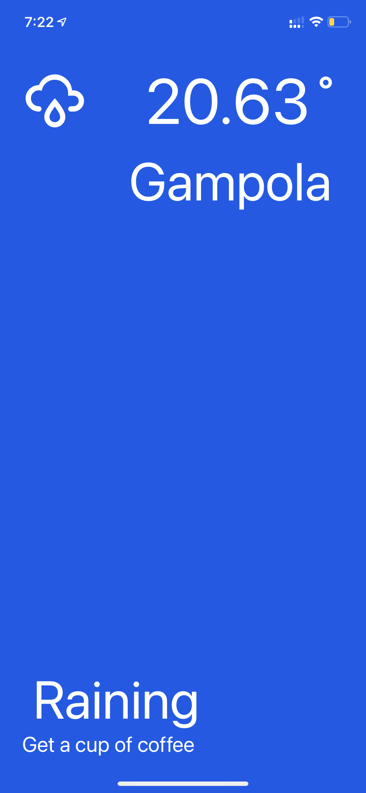

[![Contributors][contributors-shield]][contributors-url]
[![Forks][forks-shield]][forks-url]
[![Stargazers][stars-shield]][stars-url]
[![Issues][issues-shield]][issues-url]
[![MIT License][license-shield]][license-url]
[![LinkedIn][linkedin-shield]][linkedin-url]


<br />
<p align="center">
  <a href="https://github.com/Kirushan-Balakrishnan/pesto/tree/main/nWeather">
    
  </a>

  <h3 align="center">nWeather</h3>

  <p align="center">
   A weather app! 
    <br />
    <a href="https://github.com/Kirushan-Balakrishnan/pesto/tree/main/nWeather"><strong>Explore the docs »</strong></a>
    <br />
    <br />
    <a href="https://github.com/Kirushan-Balakrishnan/pesto/tree/main/nWeather">View Demo</a>
    ·
    <a href="https://github.com/Kirushan-Balakrishnan/pesto/issues">Report Bug</a>
    ·
    <a href="https://github.com/Kirushan-Balakrishnan/pesto/issues">Request Feature</a>
  </p>
</p>


<details open="open">
  <summary>Table of Contents</summary>
  <ol>
    <li>
      <a href="#about-the-project">About The Project</a>
      <ul>
        <li><a href="#built-with">Built With</a></li>
      </ul>
    </li>
    <li>
      <a href="#getting-started">Getting Started</a>
      <ul>
        <li><a href="#prerequisites">Prerequisites</a></li>
        <li><a href="#installation">Installation</a></li>
      </ul>
    </li>
    <li><a href="#usage">Usage</a></li>
    <li><a href="#roadmap">Roadmap</a></li>
    <li><a href="#contributing">Contributing</a></li>
    <li><a href="#license">License</a></li>
    <li><a href="#contact">Contact</a></li>
    <li><a href="#acknowledgements">Acknowledgements</a></li>
  </ol>
</details>


<!-- ABOUT THE PROJECT -->
## About The Project

<!-- [![Product Name Screen Shot][product-screenshot]](https://github.com/Kirushan-Balakrishnan/pesto/tree/main/nWeather) -->
 <a href="https://github.com/Kirushan-Balakrishnan/pesto/tree/main/nWeather">
    
  </a>

When you hit the app, it will tell you where you are and how's the weather of your location is!
Your Interior Weatherman!
### Built With

* [React Native](https://reactnative.dev/)
Learn once, write anywhere.


<!-- GETTING STARTED -->
## Getting Started

### Installation

1. Clone the repo
   ```sh
   git clone https://github.com/Kirushan-Balakrishnan/pesto.git
   ```
3. Let’s install Expo using npm
   ```sh
   npm install expo-cli --global
   ```
4. Starting the development server
   ```sh
   expo start
   ```


<!-- MARKDOWN LINKS & IMAGES -->
<!-- https://www.markdownguide.org/basic-syntax/#reference-style-links -->
[contributors-shield]: https://img.shields.io/github/contributors/othneildrew/Best-README-Template.svg?style=for-the-badge
[contributors-url]: https://github.com/Kirushan-Balakrishnan/pesto/graphs/contributors
[forks-shield]: https://img.shields.io/github/forks/othneildrew/Best-README-Template.svg?style=for-the-badge
[forks-url]: https://github.com/Kirushan-Balakrishnan/pesto/network/members
[stars-shield]: https://img.shields.io/github/stars/othneildrew/Best-README-Template.svg?style=for-the-badge
[stars-url]: https://github.com/Kirushan-Balakrishnan/pesto/stargazers
[issues-shield]: https://img.shields.io/github/issues/othneildrew/Best-README-Template.svg?style=for-the-badge
[issues-url]: https://github.com/Kirushan-Balakrishnan/pesto/issues
[license-shield]: https://img.shields.io/github/license/othneildrew/Best-README-Template.svg?style=for-the-badge
[license-url]: https://github.com/Kirushan-Balakrishnan/pesto/issues
[linkedin-shield]: https://img.shields.io/badge/-LinkedIn-black.svg?style=for-the-badge&logo=linkedin&colorB=555
[linkedin-url]: https://www.linkedin.com/in/kirushan-balakrishnan-5a298317a
[product-screenshot]: assets/IMG_0174.PNG
